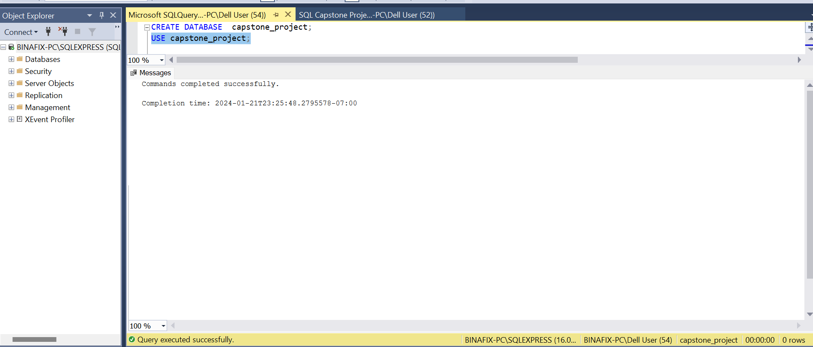
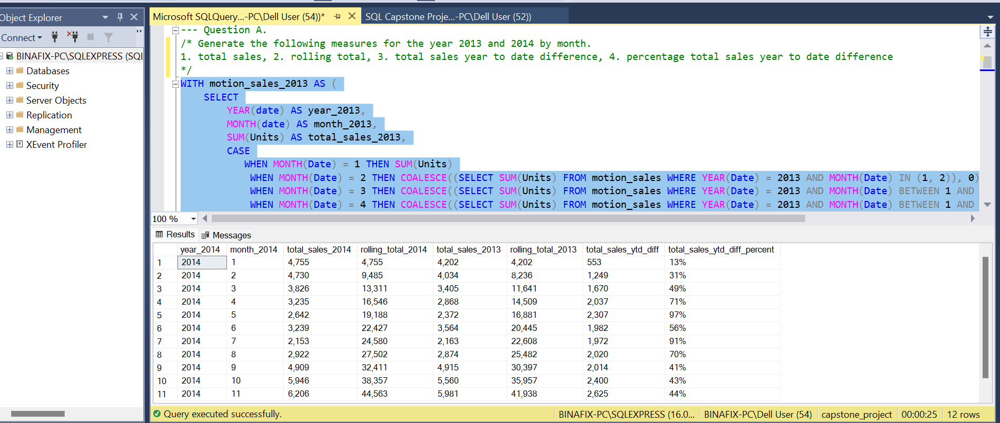
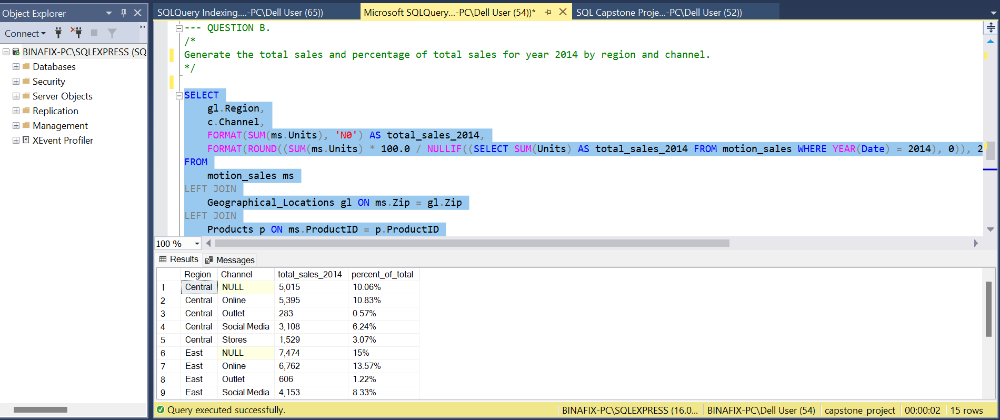
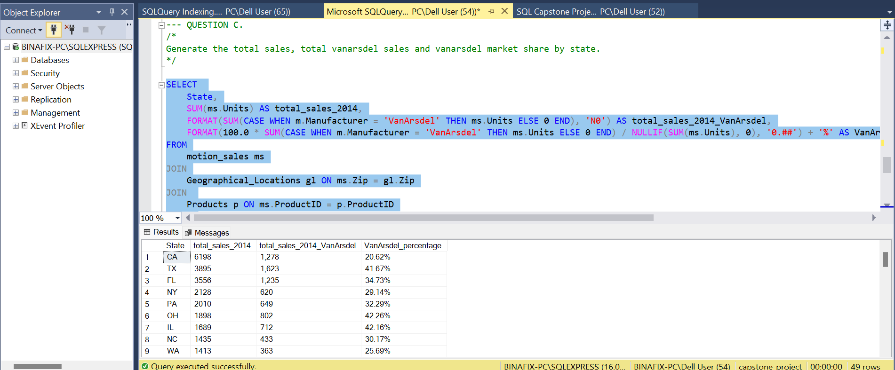

# Marketing Analysis for Motion International Company showcasing product and sales performance.
The company has requested to know their sales performance over the years across various dimensions. This project uses SQL to gather their reporting requirements and provide actionable insights for the data-driven business decisions.

Image link: https://pestleanalysis.com/what-is-marketing-analysis/

## Introduction:
This project analyses the sales, products, manufacturers, geographical locations, and customers datasets of a supply chain company, Motion International Company using SQL. The goal is to replicate a wireframe provided by the Business Analyst in consultation with the Senior Management to provide yearly insights into products, sales, geographical location performances and tailor marketing strategies to meet the business needs.

Disclaimer ⚠️: The dataset used and reports generated do not represent any company, institution, or country. It is a dummy dataset used to showcase proficiency with SQL.

## Problem Statement:
Question 1. ---  Generate the following measures for the year 2013 and 2014 by month:

* total sales
* rolling total
* total sales year to date difference
* percentage total sales year to date difference

Question 2. --- Generate the total sales and percentage of total sales for year 2014 by region and channel. 

Question 3. --- Generate the total sales, total vanarsdel sales and vanarsdel market share by state.

## Proficient SQL Skills:
- CREATE and USE Database
- SELECT, SELECT DISTINCT, FROM, WHERE clauses
- CASE WHEN, THEN
- CTE (WITH)
- COALESCE, JOIN, ON, AS
- GROUP BY, ORDER BY
- DISTINCT COUNT
- NULIF, ROUND(AVG()
- REPLACE, UPDATE, SET
- AND, OR, IS NULL, GREATER/LESS THAN, EQUAL TO
- ALTER TABLE, ADD, VARCHAR

## Data Analysis Process:
1. Creating the database/schema
I created a database and tited it "capstone_project". Then I ensured the database created was selected.

SYNTAX:✍️

                          CREATE DATABASE  capstone_project;
                        USE capstone_project;

2. Generate the following measures for the year 2013 and 2014 by month:
a. total sales,
b. rolling total,
c. total sales year to date difference,
d. percentage total sales year to date difference

SYNTAX:✍️

                WITH motion_sales_2013 AS (
            SELECT
                YEAR(date) AS year_2013,
                MONTH(date) AS month_2013,
                SUM(Units) AS total_sales_2013,
                CASE
                   WHEN MONTH(Date) = 1 THEN SUM(Units)
                    WHEN MONTH(Date) = 2 THEN COALESCE((SELECT SUM(Units) FROM motion_sales WHERE YEAR(Date) = 2013 AND MONTH(Date) IN (1, 2)), 0)
                    WHEN MONTH(Date) = 3 THEN COALESCE((SELECT SUM(Units) FROM motion_sales WHERE YEAR(Date) = 2013 AND MONTH(Date) BETWEEN 1 AND 3), 0)
                    WHEN MONTH(Date) = 4 THEN COALESCE((SELECT SUM(Units) FROM motion_sales WHERE YEAR(Date) = 2013 AND MONTH(Date) BETWEEN 1 AND 4), 0)
                    WHEN MONTH(Date) = 5 THEN COALESCE((SELECT SUM(Units) FROM motion_sales WHERE YEAR(Date) = 2013 AND MONTH(Date) BETWEEN 1 AND 5), 0)
                    WHEN MONTH(Date) = 6 THEN COALESCE((SELECT SUM(Units) FROM motion_sales WHERE YEAR(Date) = 2013 AND MONTH(Date) BETWEEN 1 AND 6), 0)
                    WHEN MONTH(Date) = 7 THEN COALESCE((SELECT SUM(Units) FROM motion_sales WHERE YEAR(Date) = 2013 AND MONTH(Date) <= 7), 0)
                    WHEN MONTH(Date) = 8 THEN COALESCE((SELECT SUM(Units) FROM motion_sales WHERE YEAR(Date) = 2013 AND MONTH(Date) <= 8), 0)
                    WHEN MONTH(Date) = 9 THEN COALESCE((SELECT SUM(Units) FROM motion_sales WHERE YEAR(Date) = 2013 AND MONTH(Date) <= 9), 0)
                    WHEN MONTH(Date) = 10 THEN COALESCE((SELECT SUM(Units) FROM motion_sales WHERE YEAR(Date) = 2013 AND MONTH(Date) <= 10), 0)
                    WHEN MONTH(Date) = 11 THEN COALESCE((SELECT SUM(Units) FROM motion_sales WHERE YEAR(Date) = 2013 AND MONTH(Date) <= 11), 0)
                    WHEN MONTH(Date) = 12 THEN COALESCE((SELECT SUM(Units) FROM motion_sales WHERE YEAR(Date) = 2013), 0)
        			ELSE 0
                END AS rolling_total_2013
            FROM
                motion_sales
            WHERE
                YEAR(date) = 2013
            GROUP BY
                YEAR(date), MONTH(date)
        ),
        motion_sales_2014 AS (
            SELECT
                YEAR(date) AS year_2014,
                MONTH(date) AS month_2014,
                SUM(Units) AS total_sales_2014,
                CASE
                    WHEN MONTH(Date) = 1 THEN SUM(Units)
                    WHEN MONTH(Date) = 2 THEN COALESCE((SELECT SUM(Units) FROM motion_sales WHERE YEAR(Date) = 2014 AND MONTH(Date) IN (1, 2)), 0)
                    WHEN MONTH(Date) = 3 THEN COALESCE((SELECT SUM(Units) FROM motion_sales WHERE YEAR(Date) = 2014 AND MONTH(Date) BETWEEN 1 AND 3), 0)
                    WHEN MONTH(Date) = 4 THEN COALESCE((SELECT SUM(Units) FROM motion_sales WHERE YEAR(Date) = 2014 AND MONTH(Date) BETWEEN 1 AND 4), 0)
                    WHEN MONTH(Date) = 5 THEN COALESCE((SELECT SUM(Units) FROM motion_sales WHERE YEAR(Date) = 2014 AND MONTH(Date) BETWEEN 1 AND 5), 0)
                    WHEN MONTH(Date) = 6 THEN COALESCE((SELECT SUM(Units) FROM motion_sales WHERE YEAR(Date) = 2014 AND MONTH(Date) BETWEEN 1 AND 6), 0)
                    WHEN MONTH(Date) = 7 THEN COALESCE((SELECT SUM(Units) FROM motion_sales WHERE YEAR(Date) = 2014 AND MONTH(Date) BETWEEN 1 AND 7), 0)
                    WHEN MONTH(Date) = 8 THEN COALESCE((SELECT SUM(Units) FROM motion_sales WHERE YEAR(Date) = 2014 AND MONTH(Date) BETWEEN 1 AND 8), 0)
                    WHEN MONTH(Date) = 9 THEN COALESCE((SELECT SUM(Units) FROM motion_sales WHERE YEAR(Date) = 2014 AND MONTH(Date) BETWEEN 1 AND 9), 0)
                    WHEN MONTH(Date) = 10 THEN COALESCE((SELECT SUM(Units) FROM motion_sales WHERE YEAR(Date) = 2014 AND MONTH(Date) <= 10), 0)
                    WHEN MONTH(Date) = 11 THEN COALESCE((SELECT SUM(Units) FROM motion_sales WHERE YEAR(Date) = 2014 AND MONTH(Date) <= 11), 0)
                    WHEN MONTH(Date) = 12 THEN COALESCE((SELECT SUM(Units) FROM motion_sales WHERE YEAR(Date) = 2014), 0)
        			ELSE 0
                END AS rolling_total_2014
            FROM
                motion_sales
            WHERE
                YEAR(date) = 2014
            GROUP BY
                YEAR(date), MONTH(date)
        )
        SELECT DISTINCT
            year_2014,
            month_2014,
            FORMAT(total_sales_2014, 'N0') AS total_sales_2014,
            FORMAT(rolling_total_2014, 'N0') AS rolling_total_2014,
            FORMAT(total_sales_2013, 'N0') AS total_sales_2013,
            FORMAT(rolling_total_2013, 'N0') AS rolling_total_2013,
            FORMAT(rolling_total_2014 - rolling_total_2013, 'N0') AS total_sales_ytd_diff,
            FORMAT(ROUND((rolling_total_2014 - rolling_total_2013) * 100.0 / NULLIF(total_sales_2013, 0), 0), '0.##') + '%' AS total_sales_ytd_diff_percent
        FROM
            motion_sales_2014 ms
        LEFT JOIN
            motion_sales_2013 ms23 ON ms.month_2014 = ms23.month_2013
        ORDER BY
            month_2014 ASC;

3. Generate the total sales and percentage of total sales for year 2014 by region and channel.

SYNTAX:✍️

            SELECT
          gl.Region,
          c.Channel,
          FORMAT(SUM(ms.Units), 'N0') AS total_sales_2014,
          FORMAT(ROUND((SUM(ms.Units) * 100.0 / NULLIF((SELECT SUM(Units) AS total_sales_2014 FROM motion_sales WHERE YEAR(Date) = 2014), 0)), 2), '0.##') + '%' AS percent_of_total
      FROM
          motion_sales ms
      LEFT JOIN
          Geographical_Locations gl ON ms.Zip = gl.Zip
      LEFT JOIN
          Products p ON ms.ProductID = p.ProductID
      LEFT JOIN
          Category c ON p.Segment = c.Category
      WHERE
          YEAR(ms.Date) = 2014
      GROUP BY
          gl.Region, c.Channel
      ORDER BY
          gl.Region, c.Channel;

4. Generate the total sales, total vanarsdel sales and vanarsdel market share by state.

SYNTAX:✍️

      SELECT 
          State,
          SUM(ms.Units) AS total_sales_2014,
          FORMAT(SUM(CASE WHEN m.Manufacturer = 'VanArsdel' THEN ms.Units ELSE 0 END), 'N0') AS total_sales_2014_VanArsdel,
          FORMAT(100.0 * SUM(CASE WHEN m.Manufacturer = 'VanArsdel' THEN ms.Units ELSE 0 END) / NULLIF(SUM(ms.Units), 0), '0.##') + '%' AS VanArsdel_percentage
      FROM
          motion_sales ms
      JOIN
          Geographical_Locations gl ON ms.Zip = gl.Zip
      JOIN 
          Products p ON ms.ProductID = p.ProductID
      JOIN 
          Manufacturer m ON m.Manufacturer = p.Manufacturer
      WHERE
          YEAR(ms.Date) = 2014
      GROUP BY
          State
      ORDER BY total_sales_2014 DESC;

